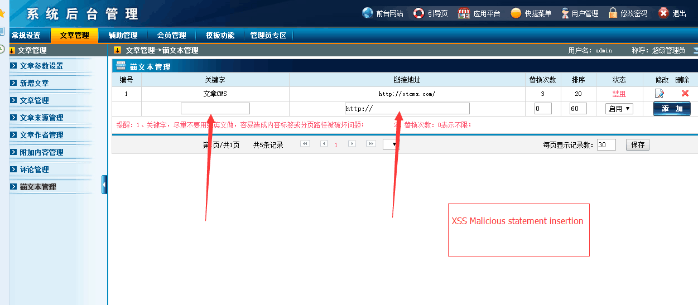
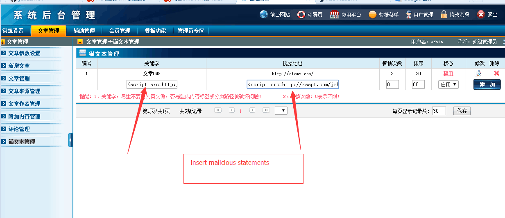
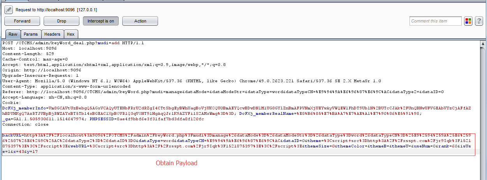
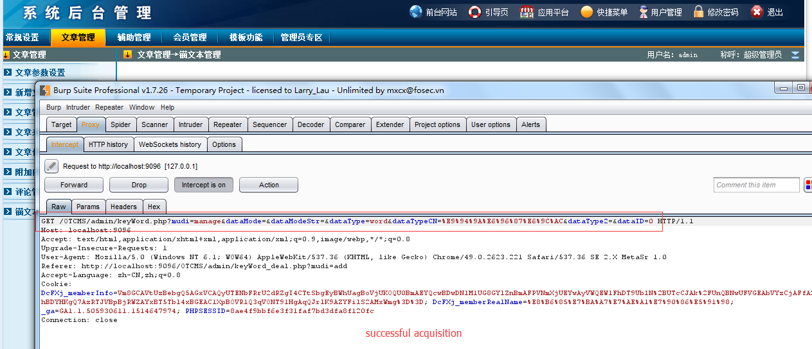
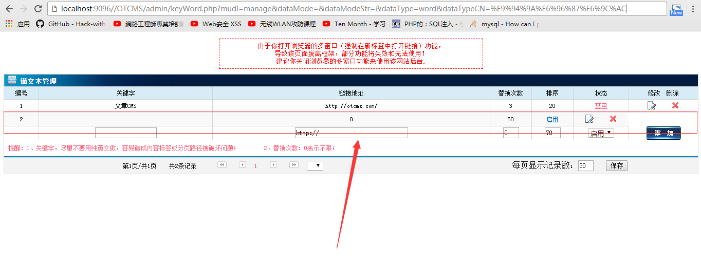
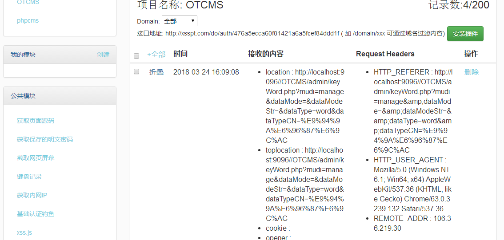

# OTCMS_3.2
###1.Vulnerability type:Cross site request XSS
###2.Vulnerability program: OTCMS v3.2.0 
###3.Download address:http://110.85.5.26:89/uploads/userup/930/OTCMS_PHP_a5.rar
###4.The official website:http://otcms.com/
###5.Vulnerability description: Adding keywords and links at the anchor text management section under article management in the background management. Because the filtering is not strict, malicious intruders can maliciously insert XSS malicious statements so that cookies can be obtained, and fishing and horse-hanging attacks can be implemented.
###6.poc:
function manage(){
	global $DB,$MB,$skin,$mudi,$dataType,$dataTypeCN,$pageCount,$recordCount;

	$dataMode		= OT::GetStr('dataMode');
	$dataModeStr	= OT::GetStr('dataModeStr');

	$judApp4 = Area::JudPayApp(4);
	if ($judApp4){
		$tabWidthStr = '5%,15%,25%,25%,6%,6%,8%,10%';
		$tabTitleStr = '编号,关键字,链接地址,样式,替换次数,排序,状态,修改　删除';
		$busiStyleStr = 'display:;';
	}else{
		$tabWidthStr = '5%,25%,40%,6%,6%,8%,10%';
		$tabTitleStr = '编号,关键字,链接地址,替换次数,排序,状态,修改　删除';
		$busiStyleStr = 'display:none;';
	}
	$skin->TableTop2('share_list.gif','',$dataTypeCN .'管理');
	$skin->TableItemTitle($tabWidthStr,$tabTitleStr);
	
	$pageSize	= $MB->mMbRow['MB_itemNum'];		//每页条数
	$page		= OT::GetInt('page');
	$showRow=$DB->GetLimit("select * from ". OT_dbPref ."keyWord where KW_type='". $dataType ."' order by KW_rank ASC",$pageSize,$page);
	if (! $showRow){
		$skin->TableNoData();
	}else{
		$recordCount=$DB->GetRowCount();
		$pageCount=ceil($recordCount/$pageSize);
		if ($page < 1 || $page > $pageCount){$page=1;}

		echo('
		<tbody class="tabBody padd3td">
		');
		$number=1+($page-1)*$pageSize;
		$rowCount = count($showRow);
		for ($i=0; $i<$rowCount; $i++){
			if ($i % 2 == 1){ $bgcolor='class="tabColorTr"'; }else{ $bgcolor=''; }

			echo('
			<tr id="data'. $showRow[$i]['KW_ID'] .'" '. $bgcolor .'>
				<td align="center">'. $number .'</td>
				<td align="center" style="word-break:break-all;">'. $showRow[$i]['KW_theme'] .'</td>
				<td align="center" style="word-break:break-all;">'. $showRow[$i]['KW_URL'] .'</td>
				<td align="center" style="word-break:break-all;'. $busiStyleStr .'">'. $showRow[$i]['KW_themeStyle'] .'</td>
				<td align="center">'. $showRow[$i]['KW_useNum'] .'</td>
				<td align="center">'. $showRow[$i]['KW_rank'] .'</td>
				<td align="center">'. Adm::SwitchBtn('keyWord',$showRow[$i]['KW_ID'],$showRow[$i]['KW_isUse'],'isUse') .'</td>
				<td align="center">
					&nbsp;&nbsp;
					
				</td>
			</tr>
			');
			$number ++;
		}
		echo('
		</tbody>
		');
	}
	unset($showRow);

	echo('
	<form method="post" id="listForm" name="listForm" action="keyWord_deal.php?mudi=add" onsubmit="return CheckForm()">
	
	<input type="hidden" id="dataType" name="dataType" value="'. $dataType .'" />
	<input type="hidden" id="dataType" name="dataTypeCN" value="'. $dataTypeCN .'" />
	<input type="hidden" id="dataID" name="dataID" value="0" />
	<tr>
		<td id="numID" align="center"> </td>
		<td align="center"><input type="text" id="theme" name="theme" size="25" style="width:120px;" /></td>
		<td align="center"><input type="text" id="webURL" name="webURL" size="25" style="width:220px;" value="http://" /></td>
		<td align="left" style="padding:3px;'. $busiStyleStr .'">
			'. AppBase::KeyWordAddi() .'
		</td>
		<td align="center"><input type="text" id="useNum" name="useNum" size="3" value="0" onkeyUp="this.value=FiltInt(this.value)" /></td>
		<td align="center"><input type="text" id="rank" name="rank" size="3" value="'. (intval($DB->GetOne("select max(KW_rank) from ". OT_dbPref ."keyWord where KW_type='". $dataType ."'"))+10) .'" onkeyUp="this.value=FiltInt(this.value)" /></td>
		<td align="center"><select id="isUse" name="isUse"><option value="1">启用</option><option value="0">禁用</option></select></td>
		<td align="center"><input id="subButton" type="image" src="images/button_add.gif" /></td>
	</tr>
	</form>
	<tr class="padd8">
		<td align="left" colspan="7" class="font2_2">
			提醒：1、关键字，尽量不要用纯英文做，容易造成内容标签或分页路径被破坏问题；&nbsp;&nbsp;&nbsp;&nbsp;2、替换次数：0表示不限；
		</td>
	</tr>
	');
###7.Test process:
We came to the background of the anchor text management add

Insert our malicious statement,Confirm add:

Obtain Payload:

successful acquisition payload:

successful acquisition cookie:

